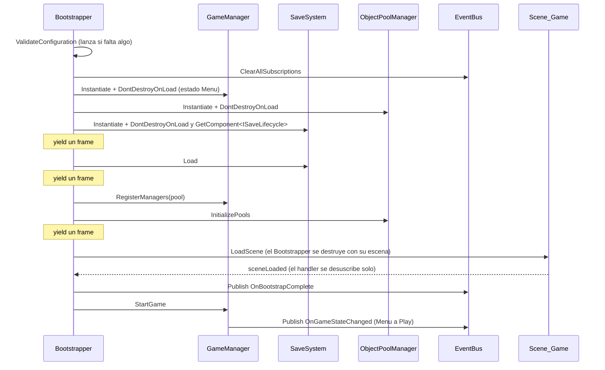
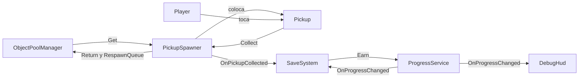
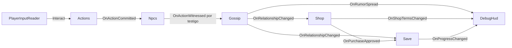

# Arquitectura de GosipSimulator

Demo de Unity 6 sobre consecuencias sociales: las acciones del jugador las pueden presenciar los NPCs,
y lo que vieron cambia cómo le tratan después. El repo es un fork de
[`DecoupledTemplate`](https://github.com/ningunFernando/DecoupledTemplate), y de esa plantilla hereda
lo que este documento describe en su mayor parte: un **EventBus tipado** más un **bootstrap
desacoplado que arranca los sistemas en un orden verificable**, con reglas que impiden repetir los
fallos auditados en el proyecto de referencia de la plantilla (HamsterBall).

- La especificación completa (14 reglas, 8 pasos, *Definition of Done*) está en
  [`GUIA_PLANTILLA_ARQUITECTURA.md`](GUIA_PLANTILLA_ARQUITECTURA.md). Es la guía de la plantilla, se
  conserva tal cual y sigue siendo la fuente autoritativa de las reglas.
- Las decisiones tomadas sobre este repo, su estado y los pendientes están en
  [`QWEN.md`](../../QWEN.md), en la raíz del repo.
- Cómo abrir el proyecto, correr los tests y cómo se hizo el renombrado del fork:
  [`README.md`](../../README.md).

Este documento describe **cómo está hecho el proyecto hoy**, no cómo debería hacerse: donde el repo se
aparta de la guía, lo dice. Todo lo que cuenta aquí existe y se ejecuta. El módulo `Gossip` está
completo desde el hito 6, dominio y adapter, y corre en `Scene_Game`; lo que todavía no existe es quien
le dé trabajo, porque nadie publica `OnActionWitnessed` hasta que exista `Npcs`. Lo que falta del
sistema de chisme va en la última sección y en el `README.md`.

## Assemblies

Diez assemblies. La guía dibuja ocho y la plantilla traía ocho, pero no las mismas: aquí no hay
`Camera` (fuera del alcance acordado) y sí hay `Pickups`, el módulo mínimo que da uso real al pool y al
guardado, más `Gossip` y `Npcs`, los dos primeros propios de este juego. Todas usan el prefijo `GosipSimulator` y su
namespace raíz coincide con el nombre de la assembly.

| Assembly | Referencia | Contenido |
|---|---|---|
| `Data` | nada | ScriptableObjects de configuración: `GameConfigSO` y, del chisme, `NpcDefinitionSO`, `GossipConfigSO`, `ActionDefinitionSO` y `SocialTie` |
| `Core` | `Data` | `Log`, `EventBus` y eventos, `GameManager` y estados (pausa incluida), `Bootstrapper`, pool de objetos, contrato `ISaveLifecycle` |
| `Save` | `Core`, `Data` | Guardado en tres capas; convierte recolecciones en progreso y guarda al pausar |
| `Player` | `Core`, `Data`, `Unity.InputSystem` | Input (movimiento y pausa) y movimiento del jugador |
| `Pickups` | `Core`, `Data` | Objetos recolectables que salen del pool y vuelven a él |
| `Gossip` | `Core`, `Data` | Opiniones entre NPCs y propagación de rumores, dominio y adapter. Vive en `Runtime/Gosip/`, con otra grafía que el nombre de la assembly |
| `Npcs` | `Core`, `Data` | Identidad de los NPCs y percepción: quién presenció qué |
| `Debug` | `Core`, `Data`, `Player` | HUD de desarrollo. Solo compila con `UNITY_EDITOR \|\| DEVELOPMENT_BUILD` |
| `Tests.EditMode` | `Core`, `Data`, `Save`, `Player`, `Debug`, `Pickups`, `Gossip`, `Npcs` | Tests de lógica pura, solo Editor |
| `Tests.PlayMode` | `Core`, `Data`, `Save`, `Player`, `Debug`, `Pickups`, `Gossip`, `Npcs`, `Unity.InputSystem` | Tests de extremo a extremo con escenas reales |

```
   Debug              Tests.EditMode / Tests.PlayMode
     │                 (referencian todos los módulos)
     ↓
   Player     Save     Pickups     Gossip     Npcs
     │          │          │          │          │
     └──────────┴──────────┼──────────┴──────────┘
                          ↓
                        Core
                          ↓
                        Data
```

Reglas del grafo (R3): `Data` no referencia nada del proyecto; `Core` solo a `Data`; los módulos de
gameplay (`Player`, `Save`, `Pickups`, `Gossip`, `Npcs`) referencian `Core` y `Data` y **nunca entre sí**;
`Debug` y los tests son hojas. Cuando un módulo necesita a otro, la respuesta es un evento: `Pickups` no
sabe que `Save` existe, solo publica `OnPickupCollected`.

Una consecuencia que ya se nota en el chisme: el `.asmdef` de `Gossip` referencia `Core` y `Data` **por
GUID**, mientras que los ocho heredados lo hacen por nombre y los dos de tests referencian `Gossip` por
nombre. Las dos formas funcionan. La diferencia práctica es que un renombrado de `Gossip` obliga a
editar los dos asmdef de tests, y un renombrado de `Core` o `Data` no obligaría a editar el de `Gossip`.

Dos consecuencias que no se ven a simple vista:

- **`Data` no puede usar tipos de `Core`.** Un ScriptableObject no puede tener un campo `GameState`
  ni una lista de `PoolConfig`: esos tipos viven en `Core`.
- **`Core` no puede ver `Save`.** Por eso `Core` declara `ISaveLifecycle` (`Load`/`Save`) y el
  `Bootstrapper` instancia el prefab de `SaveSystem` como `GameObject` sin tipo y resuelve la
  interfaz con `GetComponent`.

## Flujo de arranque

`Scene_Bootstrap` está en el índice 0 de Build Settings y solo contiene un GameObject con el
`Bootstrapper`, que tiene asignados en el Inspector los tres prefabs de sistema y el
`GameConfig_Default`.



Puntos del diseño que tienen un porqué concreto:

- **Validar antes de instanciar.** Una configuración incompleta lanza excepción al principio, no a
  mitad de la secuencia con los managers ya vivos (R9, A3).
- **El `Bootstrapper` es dueño de la vida de los managers** y los marca con `DontDestroyOnLoad` al
  crearlos. Cargar `Scene_Game` destruye todo lo que quede en `Scene_Bootstrap`: cuando solo
  `GameManager` se marcaba a sí mismo, el pool y el guardado morían en ese momento y las referencias a
  ellos seguían pareciendo asignadas.
- **`ClearAllSubscriptions` solo aquí**, antes de instanciar nada, para que ningún suscriptor
  persistente quede sordo tras recargar una escena (A1).
- **El handler de `sceneLoaded` se desuscribe a sí mismo.** No se hace en `OnDestroy`: cargar
  `Scene_Game` destruye el `Bootstrapper` antes de que Unity dispare el evento, y un `OnDestroy` que
  desuscribe deja el juego sin arrancar y sin ningún error en la consola.
- **`OnBootstrapComplete` se publica al cargar la escena, no al final de la secuencia**, porque los
  objetos de `Scene_Game` se suscriben en su `OnEnable` durante esa carga (R10).
- **Inyección explícita (R6).** El `Bootstrapper` conserva lo que instancia y se lo pasa a
  `GameManager`; los objetos de escena leen el pool de `GameManager.PoolManager` cuando llega
  `OnBootstrapComplete`. Nada del runtime usa `FindAnyObjectByType`.

### Entrar en Play desde otra escena

`Bootstrapper.CheckEntryScene` corre con `[RuntimeInitializeOnLoadMethod(AfterSceneLoad)]`. Si la
primera escena cargada está en el build con índice mayor que 0, registra un error que dice desde qué
escena entrar. Las escenas fuera del build (índice -1) no avisan, y la escena propia del Test Runner
(`InitTestScene`) se excluye por nombre porque durante una corrida reporta un índice positivo.

## EventBus y eventos

`EventBus` es estático y tipado por `struct`. Avisa con un warning cuando se publica un evento sin
suscriptores, lo que hace visible un bus decorativo (A1). Las suscripciones se hacen siempre en
`OnEnable` y se retiran en `OnDisable` (R10).

| Evento | Lo publica | Lo escuchan |
|---|---|---|
| `OnBootstrapComplete` | `Bootstrapper`, al cargar `Scene_Game` | `DebugHud`, `PickupSpawner` |
| `OnGameStateChanged` | `GameManager`, solo si la transición cambió el estado | `DebugHud`, `PlayerInputReader`, `SaveSystem` (guarda al entrar en `Paused`) |
| `OnPauseRequested` | `PlayerInputReader`, con Esc o Start | `GameManager` (alterna `Play` y `Paused`) |
| `OnPickupCollected` | `PickupSpawner`, cuando el jugador toca un pickup | `SaveSystem` (lo convierte en moneda) |
| `OnProgressChanged` | `ProgressService`, tras mutar el progreso | `SaveSystem` (marca el save como sucio), `DebugHud` |
| `OnActionCommitted` | **nadie todavía**; lo publicará `Actions` cuando el jugador haga algo | `NpcRegistry`, que resuelve quién estaba mirando |
| `OnActionWitnessed` | `NpcRegistry`, un evento por testigo y del más cercano al más lejano | `GossipManager` |
| `OnRelationshipChanged` | `GossipService`, solo si la opinión cambió de verdad | `SaveSystem`, que lo convierte en una fila persistida. Faltan `Shopkeeper` y `DebugHud` |
| `OnRumorSpread` | `GossipService`, por cada salto que de verdad mueve a alguien | **nadie en runtime**; lo escuchará `DebugHud` |
| `OnRelationshipsRestored` | `SaveSystem`, al llegar `OnBootstrapComplete` | `GossipManager` |

De los cinco, tres están conectados por los dos extremos. `OnActionWitnessed` lo publica `NpcRegistry`
y lo consume `GossipManager` desde el hito 8. `OnRelationshipChanged` lo publica `GossipService` y lo
consume `SaveSystem`, así que una opinión que se mueve acaba en el archivo. `OnRelationshipsRestored`
va en el otro sentido y se publica en cada arranque.

Quedan dos sueltos, cada uno por una punta distinta:

- **`OnActionCommitted` tiene consumidor y no productor.** Es la situación en la que estuvo
  `OnActionWitnessed` entre el hito 6 y el 8, y no cuesta nada: suscribirse sin que nadie publique no
  genera ningún aviso. El productor llega con `Actions`.
- **`OnRumorSpread` tiene productor y no consumidor**, y ese sí dispararía el aviso de `EventBus`. No
  salta porque nada publica acciones todavía, y los tests suscriben un sumidero antes de publicar nada
  para no ensuciar la consola con un aviso que no significa nada. En cuanto exista `Actions` y el
  jugador robe de verdad, ese aviso saldrá y será información buena: dirá que el HUD de opinión
  (hito 11) todavía no aprovecha lo que el chisme ya está contando.

### El ciclo de recolección

Es el único recorrido que ejercita a la vez el pool, el bus, el guardado y el HUD en tiempo de juego:



`SaveSystem` escribe el archivo al entrar en `Paused` (si hay cambios), además de en
`OnApplicationPause(true)` y `OnApplicationQuit`.

## Módulos

### Core

- **`Log`**: el único sitio que llama a `UnityEngine.Debug` (R13). `Trace` e `Info` compilan con `DEBUG`
  (Editor y development builds) y desaparecen de un build de release, llamada y string incluidos. `Trace`
  compila además si se define `GOSIPSIMULATOR_VERBOSE`, para diagnosticar un release a propósito.
  `Warn` y `Error` siempre compilan.
- **`GameManager` y la state machine**: el estado actual se deriva de la máquina en cada lectura,
  nunca se guarda en un segundo campo (R7). Pedir un estado sin implementación (`GameOver`) registra
  un error y no muta nada.
- **Pausa**: `GameManager.TogglePause` alterna `Play` y `Paused` cuando llega `OnPauseRequested`; en
  cualquier otro estado la petición se ignora. `PausedState` pone `Time.timeScale` a 0 y al salir
  restaura el valor anterior. El input sigue llegando durante la pausa porque corre en tiempo sin
  escalar; la física, `FixedUpdate` y los temporizadores con `deltaTime` se detienen.
- **`ObjectPoolManager`**: los objetos salen activos también cuando el pool se expande, y devolver dos
  veces el mismo objeto se ignora con un aviso (C1, M3). Hoy tiene un pool, `Pickup`, con 4 objetos.

### Save

| Capa | Tipo | Responsabilidad |
|---|---|---|
| Infraestructura | `ISaveStorage`, `JsonSaveStorage` | Leer y escribir disco con escritura transaccional (`.tmp` y luego mover) |
| Dominio | `ProgressService`, `RelationshipStore`, `SaveMigrations`, `SaveData`, `RelationshipRow` | Mutar el progreso y las opiniones validando invariantes; migrar versiones en cadena |
| Adapter | `SaveSystem` | Ciclo de vida de Unity: `persistentDataPath`, pausa del juego y de la aplicación, eventos del bus |

`RelationshipStore` es a las opiniones lo que `ProgressService` es a la moneda, y comparte su forma: C#
puro, dueño de una invariante, probado en EditMode sin escena. La invariante aquí es la dispersión, la
misma que `RelationshipGraph`: una opinión de vuelta a cero borra su fila en vez de dejar un cero en el
archivo, así que el save solo crece con opiniones que de verdad se movieron. Rechaza además la pareja
consigo mismo, que `RelationshipGraph` no aceptaría al cargarla de vuelta, y devuelve `false` en vez de
lanzar: un evento mal formado cuesta una fila, no la partida (R9).

El save lleva `saveVersion` desde el primer día y se migra, nunca se borra: antes de migrar se hace
backup (R14). `OnApplicationPause(true)` es el disparador de guardado de plataforma, porque
`OnApplicationQuit` no es fiable en móvil (C6); la pausa del juego es el punto de guardado dentro de la
partida.

### Player

| Tipo | Clase | Responsabilidad |
|---|---|---|
| Adapter de input | `PlayerInputReader` | Lee `Player/Move` y `Player/Pause` por `InputActionReference` (M9). Solo deja pasar el movimiento en estado `Play`, que conoce por `OnGameStateChanged`; la pausa la publica como petición |
| Dominio | `PlayerMovement` | Calcula la velocidad horizontal con `Vector3.SmoothDamp` (M2). Recorta el input a longitud 1 y rechaza valores negativos o NaN |
| Adapter físico | `PlayerMover` | En `FixedUpdate` aplica esa velocidad al `Rigidbody` y conserva la vertical para la gravedad |

Los adapters validan sus referencias y valores en `OnValidate` y otra vez en `Awake` (R8); si algo
falta, registran el error y se deshabilitan (R9). Ojo con un detalle de Unity: `enabled = false`
dentro de `Awake` llama a `OnDisable` en el acto, antes de cualquier `OnEnable`, así que cada
`OnDisable` solo deshace lo que su `OnEnable` hizo de verdad. En `Scene_Game` el `Player` es una
cápsula con el tag `Player`, rotación congelada e interpolación, sobre un plano.

### Pickups

| Tipo | Clase | Responsabilidad |
|---|---|---|
| Adapter | `PickupSpawner` | Mantiene un pickup en cada punto: los saca del pool al llegar `OnBootstrapComplete`, los devuelve al recogerlos y publica `OnPickupCollected`. Al desactivarse devuelve los suyos, porque viven bajo el contenedor `DontDestroyOnLoad` del pool |
| Adapter | `Pickup` | Trigger con valor (mínimo 1). Detecta al jugador por el tag del `Rigidbody` y avisa a su spawner, que se le asigna en cada salida del pool (`IPoolable`) |
| Dominio | `RespawnQueue` | Qué puntos esperan reaparición y cuánto falta. Un `Tick` sin tiempo transcurrido no libera nada, que es lo que la detiene en pausa |

Entrar en Play directamente desde `Scene_Game` no hace aparecer pickups: sin bootstrap no hay pool.

### Gossip

El primer módulo propio del juego, y desde el hito 6 el único del chisme que está completo: las tres
capas de dominio más el adapter que lo conecta a una partida.

| Tipo | Clase | Responsabilidad |
|---|---|---|
| Datos | `RelationshipGraph` | Opiniones dirigidas `(npc, acercaDe) → int`, con tope configurable. Disperso: un delta cero no crea entrada y un `Set` a cero la borra, así que `Count` y el save solo crecen con opiniones que de verdad se movieron |
| Datos | `SocialGraph` | Quién confía en quién y cuánto. Inmutable tras construirse y con los lazos ordenados por id, porque el orden de un `Dictionary` no es contractual y un frente sin orden haría que el recorrido variara entre ejecuciones |
| Dominio | `RumorPropagator` | `Plan` devuelve todos los saltos como datos, en anchura. Cada NPC se entera una vez y por el camino más corto. `Carry` aplica la confianza y luego el decaimiento, y un salto que se trunca a cero no se planea |
| Dominio | `GossipService` | Dueño del grafo de opiniones. `WitnessAction` mueve al testigo y encola la historia; `Tick` libera los saltos vencidos en tiempo de juego, así que la pausa los detiene; `Restore` aplica un save en silencio |
| Adapter | `GossipManager` | Construye el servicio desde los SO en `Awake`, se suscribe en `OnEnable` y llama a `Tick(Time.deltaTime)` en `Update`. Traduce `SocialTie` a `SocialGraph.Tie` y resuelve el `actionId` del evento a su delta base. Vive en el objeto `SocialGraph` de `Scene_Game` |

Tres detalles que no se ven en las firmas:

- **`Restore` no publica.** Aplicar un save por `Apply` publicaría un `OnRelationshipChanged` por fila,
  y `SaveSystem` escucha ese evento para marcar el save como sucio: una partida recién cargada se
  reescribiría a sí misma en el acto.
- **`Tick` entrega después de dejar la cola consistente.** Un suscriptor de `OnRelationshipChanged`
  puede provocar otro avistamiento, y mutar la cola mientras se recorre perdería o duplicaría saltos. Es
  el mismo índice de escritura por separado que usa `RespawnQueue.Tick`.
- **`WitnessAction` devuelve `false` en vez de lanzar** cuando el actor es su propio testigo.
  `RelationshipGraph` rechaza esa pareja, y tumbar la partida por un filtro que pertenece a la capa de
  percepción sería el cambio equivocado. El `bool` es lo que evita que la decisión sea silenciosa (R9).

En `Data`, la configuración: `NpcDefinitionSO` (id, nombre visible y lazos), `GossipConfigSO` (tope de
opinión, decaimiento, saltos máximos y retardo por salto), `ActionDefinitionSO` (id, nombre visible y
delta base) y `SocialTie`, que es el lazo serializable. `ActionDefinitionSO` lleva tres campos y no los
cinco que se esbozaron: no hay severidad ni `requiresTarget` porque nada los lee hasta que exista
`ActionCatalog`, y un asset de configuración relleno para parecer completo es el M11 que la guía
prohíbe. `GameConfigSO` con un solo campo es el precedente.

`SocialTie` y `SocialGraph.Tie` son dos tipos para lo mismo, y es a propósito: `Gossip` no puede
arrastrar la serialización de Unity hasta su dominio, y `Data` no puede referenciar `Gossip`. El adapter
traduce de uno a otro en la frontera, igual que `ISaveLifecycle` separa `Core` de `Save`.

### Npcs

El segundo módulo propio del juego, y el que hace que una acción tenga consecuencias sociales en vez de
quedarse en un evento que nadie recoge.

| Tipo | Clase | Responsabilidad |
|---|---|---|
| Dominio | `PerceptionResolver` | Quién vio algo. Candidatos como datos, distancia al cuadrado, y el actor fuera siempre porque está de pie donde ocurrió. Devuelve los testigos del más cercano al más lejano |
| Adapter | `Npc` | Un aldeano: su `NpcDefinitionSO` y su alcance de vista. Sin identidad se deshabilita a sí mismo |
| Adapter | `NpcRegistry` | Sabe quién está en la escena, escucha `OnActionCommitted`, construye los candidatos con las posiciones de ese momento y publica un `OnActionWitnessed` por testigo |

Tres decisiones que no se ven en las firmas:

- **El orden de los testigos es parte del contrato.** Del más cercano al más lejano, y los empates se
  rompen por id. Decide quién se forma una opinión primero y por tanto qué rumor se encola primero, así
  que dejarlo al orden en que se autoró la escena haría que el mismo robo se desarrollara distinto entre
  ejecuciones. Es el mismo motivo por el que `SocialGraph` ordena sus lazos.
- **Solo distancia, sin línea de visión.** Una pared no tapa nada todavía. Añadirla significa física, que
  es el mundo del adapter y no el del dominio, así que cuando valga la pena irá en `NpcRegistry` como un
  filtro sobre esta respuesta, no dentro del resolver.
- **Los candidatos se reconstruyen en cada acción**, no se cachean. Un NPC que se mueve haría que la
  percepción respondiera por donde solía estar.

El id de cada NPC sale de su `NpcDefinitionSO`, el mismo asset que construye el grafo social, y no de un
campo de texto. Escribir `blacksmith` a mano en dos sitios está a una errata de un aldeano del que nadie
puede cotillear.

### Debug

`DebugHud` usa **UI Toolkit** (la guía pide Canvas con TextMeshPro; la decisión está en `QWEN.md`).
Un `UIDocument` con `PanelSettings_DebugHud` y un `Label` creado por código muestra si terminó el
bootstrap, el estado actual y la moneda (desde el primer `OnProgressChanged`). La lógica del texto
vive en `DebugHudModel`, en C# puro. Como el `Label` lo crea el script, en un build sin la assembly
`Debug` el `UIDocument` queda vacío.

En un build de release, además, el log del player avisa de que el componente `DebugHud` no tiene
script. Es lo esperado: la assembly `Debug` no entra en ese build (comprobado con builds reales el
2026-09-14). `OnBootstrapComplete` no avisa de falta de suscriptores porque también lo escucha
`PickupSpawner`; antes del ciclo de recolección ese warning sí salía en release.

## Tests

Los tests vienen de la plantilla: cubren los bugs reales de la auditoría y demuestran que los
sistemas están conectados. Los del chisme son nuevos y cubren solo lógica pura.

- **EditMode** (lógica pura, milisegundos): `PerceptionResolver` (20 casos), `EventBus`, state machine, `GameManager` (pausa incluida),
  pool, save (almacenamiento, migraciones, progreso), regla de la escena de entrada, texto del HUD,
  movimiento del jugador (incluido que se sienta igual a 30 y a 120 fps) y `RespawnQueue`. Del chisme:
  `RelationshipGraph` (29 casos), `RumorPropagator` (22) y `GossipService` (24).
- **PlayMode** (escenas reales): el arranque completo desde `Scene_Bootstrap` y que los managers
  sobrevivan a él, que el HUD reciba los eventos, el error al entrar desde `Scene_Game`, un teclado
  virtual que mueve al jugador solo en `Play` y lo detiene al soltar, Esc que pausa, congela al jugador
  y reanuda, y el ciclo de recolección completo, con el save redirigido a un archivo temporal. También
  que `PlayerMover` y `PlayerInputReader` se deshabiliten con un error claro si les falta
  configuración.

El número de tests, su duración y los errores esperados en consola están en el `README.md`.

**El chisme tiene 75 casos de EditMode y 6 de PlayMode.** Los de EditMode cubren el dominio y corren
contra el bus con sumideros en vez de suscriptores reales. Los 6 de PlayMode llegaron con el adapter, en
`GossipFlowTests`, y son los que comprueban que el módulo existe de verdad en una partida: que
`Scene_Game` construye un `GossipManager` desde los assets, que un `OnActionWitnessed` en el bus mueve
al testigo y publica el cambio, que el rumor llega al herrero en -5 y al aldeano en -1 y muere antes del
anciano, que pausar detiene una historia a medio camino y reanudar la termina, que `Restore` aplica un
save sin publicar nada, y que una acción sin definición se rechaza con un error y no mueve a nadie.

Los números de ese tercer test son los de los assets de la aldea, no constantes inventadas: si alguien
retoca `Robbery` o el decaimiento, el test falla y dice que la documentación del README ya no vale.

## Resumen de las 14 reglas

| # | Regla |
|---|---|
| R1 | Assembly Definitions antes del primer `.cs` |
| R2 | Namespace en todos los tipos |
| R3 | Grafo de assemblies acíclico; módulos de gameplay nunca se referencian entre sí |
| R4 | Los módulos de gameplay se comunican solo por `EventBus` |
| R5 | Lógica de dominio en C# puro; el `MonoBehaviour` es un adapter fino |
| R6 | Nada de `FindAnyObjectByType` para cablear; quien crea, inyecta |
| R7 | Una sola fuente de verdad por concepto |
| R8 | Validar campos serializados en `OnValidate` y en `Awake` |
| R9 | Nunca degradar en silencio: deshabilitar, lanzar o usar un fallback válido |
| R10 | Suscripciones solo en `OnEnable`/`OnDisable` |
| R11 | Un solo dueño por responsabilidad |
| R12 | Cero stubs silenciosos; pendientes como `TODO(Fase-N)` |
| R13 | Ningún `Debug.Log` fuera de `Log.cs` |
| R14 | El save se migra, nunca se borra |

## El sistema de chisme: lo que falta

`Gossip` ya existe entero, dominio y adapter, y está descrito en [Módulos](#gossip). Esta sección cubre
las otras tres assemblies y el recorrido completo, que es lo que le da trabajo a ese módulo. Va aquí
porque cambia el grafo de assemblies y porque la restricción R3 obliga a una decisión concreta sobre
cómo circula el estado.

### Dos hojas nuevas

`Npcs` ya existe y está descrita más arriba. Quedan dos assemblies, las dos con `Core` y `Data` como
únicas referencias del proyecto, y sin referenciarse entre ellas ni con `Gossip` o `Npcs`. El grafo
sigue siendo acíclico y `Debug` y los tests siguen siendo las únicas hojas que referencian todos los
módulos.

| Assembly | Referencia | Contenido previsto |
|---|---|---|
| `Actions` | `Core`, `Data`, `Unity.InputSystem` | Verbos del jugador. Valida y publica, no interpreta |
| `Shop` | `Core`, `Data` | Condiciones del herrero: multiplicador de precio y negativa |

De `Gossip` y de `Npcs` no falta nada: los hitos 6 y 8 los dejaron corriendo en `Scene_Game`.

Dos grafos distintos, y conviene no mezclarlos:

- **Grafo social** (NPC contra NPC, con pesos de confianza). Estático, viene de la configuración en
  `Data`. Determina por dónde viaja un rumor y con cuánta fuerza.
- **Grafo de opiniones** (NPC hacia el jugador, con signo). Dinámico, es lo que se persiste.

### El recorrido



Ninguna flecha es una referencia entre assemblies: todas son publicaciones en el bus (R4). `Actions`
no sabe quién miraba, `Npcs` no sabe qué opina nadie de nadie, `Gossip` no sabe que existe una tienda
y `Shop` no sabe cómo se propagó el rumor.

De las nueve flechas, **ocho siguen sin existir en una partida**. La que funciona es la última,
`Save → HUD` por `OnProgressChanged`, que viene del ciclo de recolección heredado y no del chisme. El
diagrama es el destino y no el estado: faltan los tres módulos que emiten o reciben las otras, y los
cinco eventos de la tienda y las acciones que aún no se han definido en `Core` porque nada los
publicaría.

Lo que cambió con el hito 6 es el extremo de `Gossip`, que ya no es solo un contrato probado: hay un
`GossipManager` vivo en la escena que recibe `OnActionWitnessed` de verdad y emite
`OnRelationshipChanged` y `OnRumorSpread` de verdad, comprobado de extremo a extremo en PlayMode. Las
flechas `Npcs → Gossip` y `Gossip → Save` tienen ya su mitad de `Gossip` construida y esperando.

### La consecuencia de R3: el estado se empuja, no se tira

`Shop` necesita saber qué opina el herrero del jugador, y no puede referenciar `Gossip`. Las salidas
son dos y se eligió la segunda:

1. Mover el almacén de relaciones a `Core` y dejar `Gossip` como motor de reglas. Rompe la idea de que
   `Core` es andamiaje y no gameplay, y convierte un concepto del juego en una dependencia de todos.
2. **Que cada consumidor cache lo suyo a partir de `OnRelationshipChanged`.** Es exactamente lo que ya
   hacen `DebugHud` con `OnProgressChanged` y `SaveSystem` con `OnPickupCollected`, así que no añade un
   patrón nuevo. R7 se respeta porque cada concepto tiene un dueño: la opinión es de `Gossip`, el
   multiplicador de precio es de `Shop`.

El precio es el orden de carga. Un consumidor que se suscriba tarde se pierde los cambios anteriores, y
al cargar una partida todos los cambios ya ocurrieron. Se resuelve sin acoplar los módulos:

- `Gossip` construye su grafo desde la configuración en `Awake`, no en un handler.
- `SaveSystem`, que ya vive en `DontDestroyOnLoad` y ya escucha el bus, publica `OnRelationshipsRestored`
  al llegar `OnBootstrapComplete`, con las opiniones que leyó del archivo.
- `Gossip` las aplica encima de lo que construyó.

Como `OnBootstrapComplete` se publica después de cargar `Scene_Game`, los objetos de la escena ya están
suscritos en su `OnEnable` (R10), y ninguno de los dos módulos depende del orden en que el bus reparta
los handlers.

### Persistencia

**Hecho en el hito 7.** `SaveData` está en `CURRENT_VERSION = 2` con una lista de `RelationshipRow`, y
`SaveMigrations` tiene su primera entrada real, `[1]`: añade la lista vacía y conserva moneda y
acumulado. R14 se cumple de verdad y hay un test de PlayMode que lo comprueba contra un archivo v1
escrito a mano, incluida la copia `.v1.bak`, que es byte a byte la original porque `Backup` copia el
archivo en vez de volver a serializar el objeto.

La simetría con lo que ya existía resultó ser exacta: igual que `SaveSystem` convierte
`OnPickupCollected` en moneda sin que `Pickups` lo sepa, ahora convierte `OnRelationshipChanged` en una
fila persistida sin que `Gossip` lo sepa. Lo que queda de esa frase es `OnPurchaseApproved` en un
`TrySpend`, que llega con `Shop`.

Un detalle que solo se ve al escribirlo: `GossipService.Restore` tiene que seguir siendo silencioso. Si
publicara un `OnRelationshipChanged` por fila, `SaveSystem` se marcaría sucio al cargar y la partida se
reescribiría a sí misma en la primera pausa. Hay un test de PlayMode dedicado a eso, y falla borrando el
archivo después de cargar y comprobando que una pausa no lo vuelve a crear.

